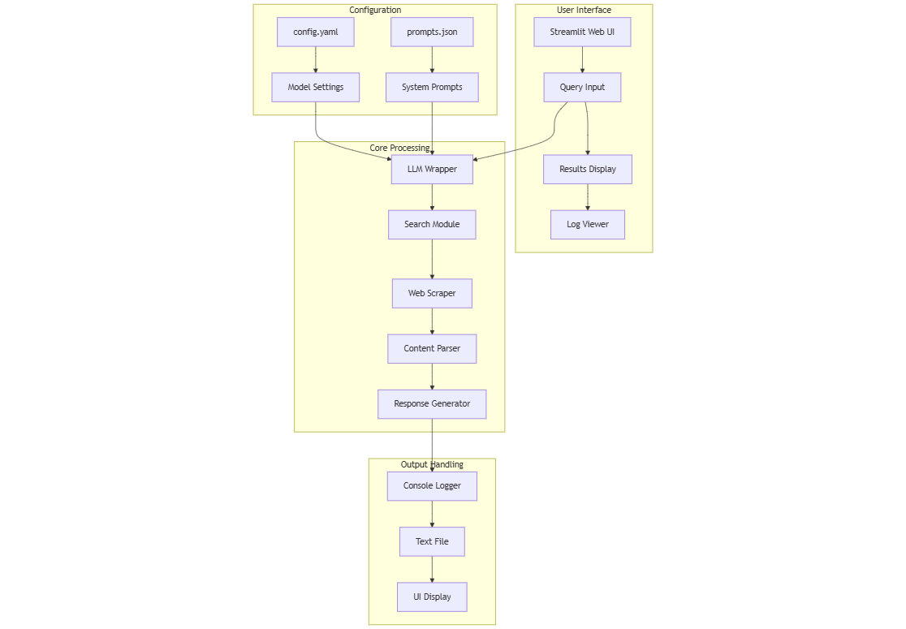

# 🚀 Real-Time Context-Aware AI Agents: Searching, Scraping, and Synthesizing for Precision

From Search to Synthesis: Building Your AI Business Intelligence Team

## ⚡ TL;DR

We've built a cutting-edge system where multiple AI agents collaborate like a high-performing office team — one searches the web, another validates information, a third analyzes it, and a fourth makes recommendations. Imagine having 24/7 AI assistants that turbocharge your business decision-making process.

## 🌟 Introduction

Imagine having a team of tireless, hyper-intelligent assistants who could search the entire internet, gather relevant information, analyze it, and deliver precise answers — all in real-time. This isn't science fiction anymore. In this article, we'll show you how to build exactly that using AI agents that work together like a well-oiled machine. We're not just talking about basic chatbots; we're talking about AI assistants that understand context, learn from their searches, and deliver precise, actionable insights.

## 🔍 What's This Project About?

This article is your ultimate guide to building a system of AI agents that work together intelligently. Think of it like assembling a special ops task force:

- 🕵️‍♂️ The Search Agent: Your digital research ninja, finding relevant information across the web
- 🔎 The Validation Agent: Your fact-checking detective, ensuring information reliability
- 🧠 The Analysis Agent: Your data whisperer, breaking down complex information into digestible insights
- ✍️ The Synthesis Agent: Your executive strategist, crafting clear, actionable recommendations

The best part? These agents work in parallel — while one is searching, another is analyzing, making the whole process lightning fast. We'll show you how to build this system step by step, using real code and practical examples.

## 💡 Why Work on It?

In today's fast-paced business world, making quick, well-informed decisions is crucial. Consider these game-changing scenarios:

- ⏩ Market research that used to take weeks can be done in hours
- ⚡ Customer feedback analysis that took days happens in minutes
- 🤖 Competitive analysis that required teams of analysts can be automated

While our example uses a fictional company, the principles and code we share are real and battle-tested. You'll learn:

- 🧩 How to break down complex business problems into manageable pieces
- ⚙️ Ways to use AI for parallel processing of information
- 🎨 Techniques for combining multiple AI perspectives into actionable insights
- 📈 Methods for scaling your decision-making processes without losing quality

## 🏗️ Architecture


# 🧬 AI Agents Architecture Flow Explanation

Our design follows a four-layer architecture optimized for web search, analysis, and response generation:

**User Interface Layer:** The Streamlit web UI serves as the main entry point. Users input their queries here, and it immediately shows both their results and detailed processing logs. We chose Streamlit because it provides a clean, professional interface without complex frontend development.

**Configuration Layer:** We've separated the configuration into two key files:

- `config.yaml` handles all model settings like temperature, context size, and technical parameters
- `prompts.json` stores system prompts and instructions

This separation lets users modify behavior without touching the code. When someone wants to tune the AI's responses or adjust the model, they simply update these files.

**Core Processing Layer:** This is where the magic happens. We've built it as a pipeline with four key components:

- 🤖 LLM Wrapper — Handles all direct interactions with the AI model
- 🔍 Search Module — Performs web searches and gathers initial data
- 🕸️ Web Scraper — Extracts relevant content from found web pages
- 📑 Content Parser — Processes and structures the scraped information
- 🎯 Response Generator — Creates the final, coherent response

We designed this pipeline to work in parallel when possible, significantly speeding up the overall process. Each component can work independently but maintains a clean data flow between stages.

# 🛠️ Tutorial: Real-Time Context-Aware AI Agents: Searching, Scraping, and Synthesizing for Precision

## 📋 Prerequisites
- Python installed on your system
- Basic understanding of virtual environments and command-line tools

## 🚦 Steps

1. **Virtual Environment Setup:**
   - Create a dedicated virtual environment for our project:
   
     ```bash
     python -m venv Real-Time-Context-Aware-AI-Agents-Searching-Scraping-and-Synthesizing-for-Precision
     ```
   - Activate the environment:
   
     - Windows:
       ```bash
       Real-Time-Context-Aware-AI-Agents-Searching-Scraping-and-Synthesizing-for-Precision\Scripts\activate       
       ```
     - Unix/macOS:
       ```bash
       source Real-Time-Context-Aware-AI-Agents-Searching-Scraping-and-Synthesizing-for-Precision/bin/activate
       ```

# 🛠️ Installation and Setup Guide

**Install Project Dependencies:**

Follow these steps to set up and run the "Real-Time Context-Aware AI Agents: Searching, Scraping, and Synthesizing for Precision"

1. Navigate to your project directory:
   ```bash
   cd path/to/your/project
   ```
   This ensures you're in the correct location for the subsequent steps.

2. Install the required dependencies:
   ```bash
   pip install -r requirements.txt   
   ```
   This command installs all the necessary Python packages listed in the requirements.txt file.

## 🏃 Run - Hands-On Guide: Real-Time Context-Aware AI Agents: Searching, Scraping, and Synthesizing for Precision

   ```bash 
   # Run 
   streamlit run app.py      
   ```

## 🎉 Conclusion and Next Steps

Congratulations! You've just built your own Real-Time Context-Aware AI Agents: Searching, Scraping, and Synthesizing for Precision system. The future of intelligent decision-making is now in your hands!